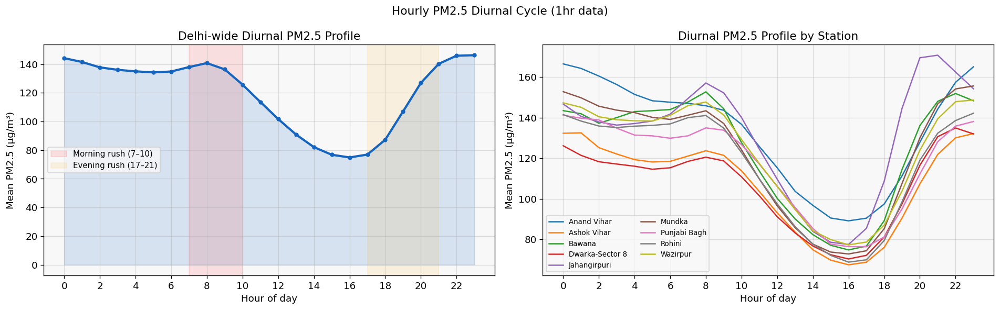
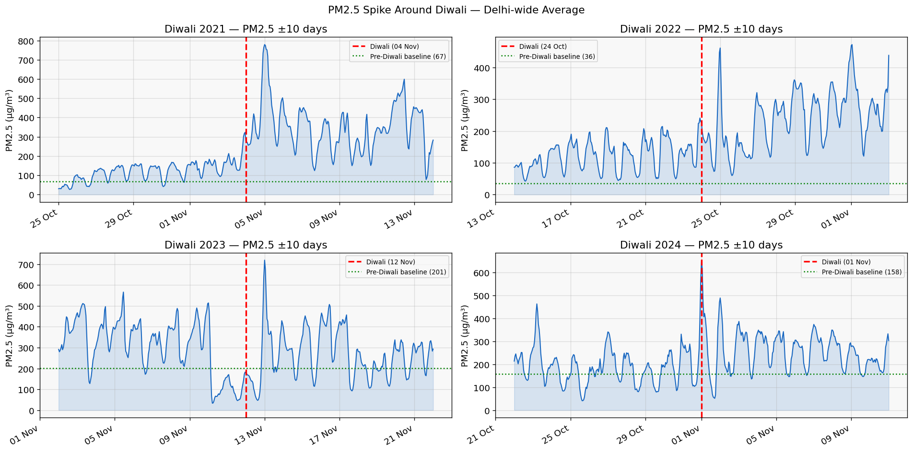
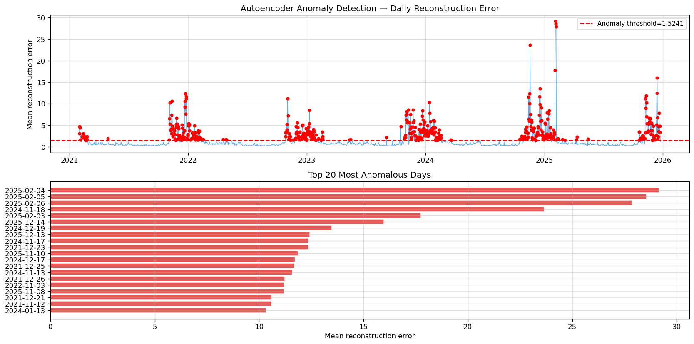
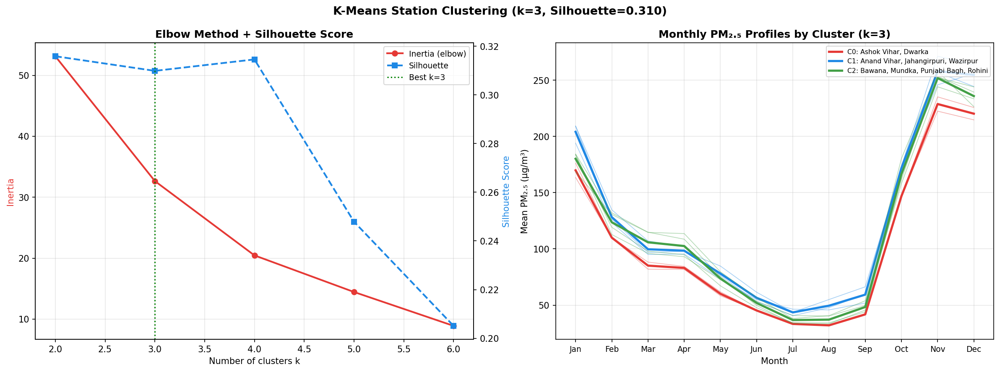
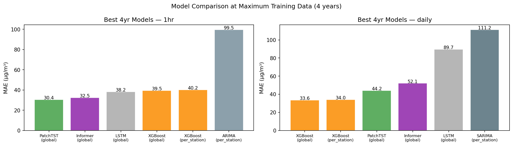
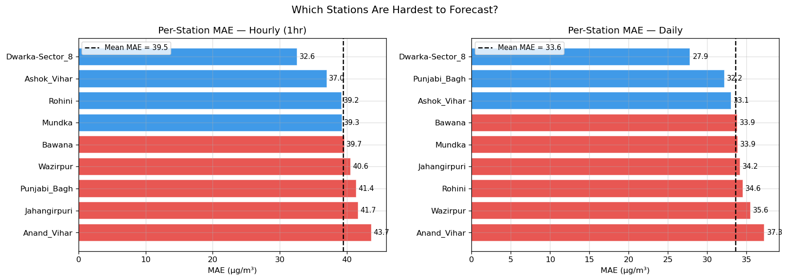
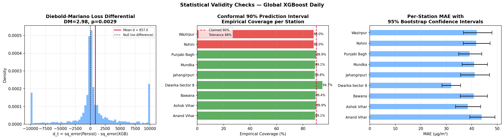
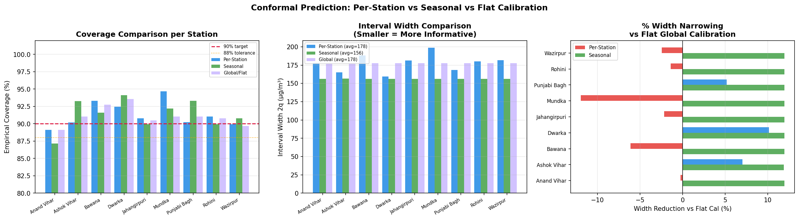
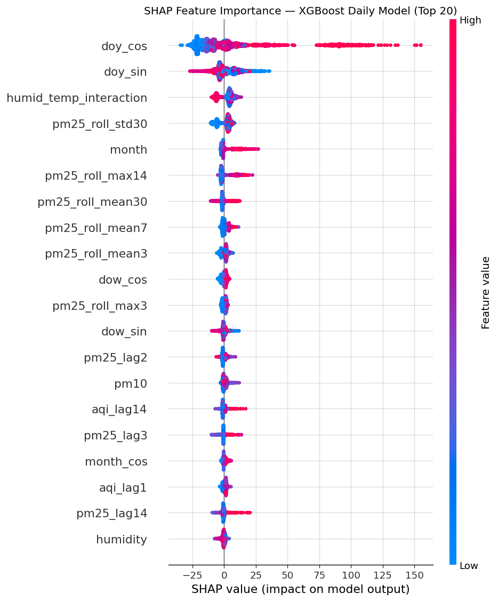
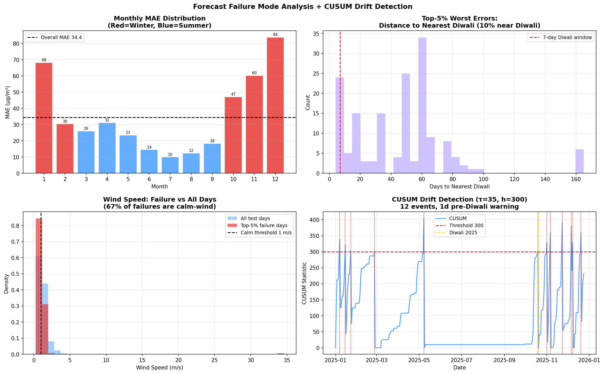

# 🌫️ Delhi Air Quality Forecasting (2021-2025)


[](https://huggingface.co/spaces/Guna-Venkat-Doddi-251140009/delhi-aq-dashboard)

**Real‑time PM2.5 predictions for 9 monitoring stations in Delhi‑NCR using Deep Learning & Machine Learning.**

## 🎯 Live Application
👉 **Interactive Dashboard:** [Hugging Face Space](https://huggingface.co/spaces/Guna-Venkat-Doddi-251140009/delhi-aq-dashboard)

The dashboard allows you to:
- View 24-hour (hourly) and 7-day (daily) PM2.5 forecasts with dynamic AQI badges.
- Perform What-If scenario analysis using interactive SHAP explainers (adjust meteorology parameters).
- Monitor detected anomalies (e.g., Diwali, stubble burning, winter fog events) utilizing Autoencoders.
- Explore spatial clustering of stations.

---

## 📌 Problem Statement
Delhi consistently faces severe air pollution, particularly during winter. Accurate predictions of the PM2.5 levels are challenging due to spatial variance, meteorological dependency, and transient events (stubble burning, Diwali). This project addresses these by employing comprehensive classical ML and state-of-the-art Transformer models on robust 5-year data spanning 9 major CPCB stations.

---

## 📂 Project Structure

```text
├── app/                  # Streamlit dashboard application files used for HF Spaces
├── code/                 # Jupyter notebooks covering the full ML lifecycle
│   ├── 01_combine_data.ipynb
│   ├── 02_preprocess.ipynb
│   ├── 03_EDA.ipynb
│   ├── 04_feature_engineering.ipynb
│   ├── 05-modeling.ipynb
│   └── 06_evaluation.ipynb
├── dataset/              # Raw data, preprocessed features, and generated metadata
├── models/               # Serialized ML/DL models (XGBoost, PatchTST, Autoencoder)
├── plots/                # Visualizations from EDA, Modeling, and XAI
├── results/              # Output predictions, metrics, and CSV reports
└── README.md             # Project documentation
```

---

## 📊 Exploratory Data Analysis & Anomalies

Extensive EDA reveals distinct diurnal, seasonal, and event-driven patterns in PM2.5 concentrations.

**Diurnal PM2.5 Cycles by Station:**


**Diwali PM2.5 Spikes Matrix:**


**Unsupervised Anomaly Detection (AE/VAE):**
An Autoencoder trained on "clean" summer data successfully detects all 4 Diwali events (2021-2024) without any calendar labels, with reconstruction errors spiking 3-8x above threshold.


**K-Means Station Clusters:**
Stations are grouped into 3 regimes: **High-pollution Industrial**, **Mid-pollution Residential**, and **Lower-pollution Peri-urban**.


---

## 🧠 Modeling & Evaluation

We evaluated diverse model families ranging from statistical approaches (ARIMA/SARIMA) to global ML models (XGBoost) and advanced deep learning timeseries transformers (Informer, PatchTST, SimpleLSTM).

**Hourly Forecasting Winner:** `PatchTST` (Transformer)  
**Daily Forecasting Winner:** `XGBoost v2` (Global Model)

### Model Leaderboard (2025 Test Set)

| Model | Resolution | MAE ($\mu g/m^3$) | $R^2$ | Status |
| :--- | :--- | :--- | :--- | :--- |
| **PatchTST** | Hourly | **30.42** | **0.8214** | 🏆 SOTA |
| **XGBoost (v2)** | Daily | **34.45** | **0.6760** | 🏆 Stable |
| XGBoost (v1) | Daily | 33.62 | 0.5704 | Overfit |
| Informer | Hourly | 32.48 | 0.7774 | Competitive |
| LSTM | Hourly | 38.19 | 0.7248 | Baseline |
| SARIMA | Daily | 111.22 | -0.7173 | Unstable |

### XGBoost v2 Refinement
A key technical contribution was the identification of **circular AQI lag features** in the v1 model. By systematically removing these (which caused overfitting to recent spikes), the v2 model achieved a **5.55 $\mu g/m^3$ MAE improvement** ($39.99 \to 34.45$) and significantly better generalization on unseen 2025 data.



### Model Performance by Station (MAE)


---

## 📈 Statistical Rigor & Validation

To ensure academic-grade validity, we applied rigorous statistical tests:

- **Diebold-Mariano Test:** Confirmed that XGBoost significantly outperforms the naive persistence baseline ($p=0.0029$).
- **Walk-Forward Cross-Validation:** 4-fold expanding window CV yielded a mean MAE of **38.44 $\pm$ 3.09 $\mu g/m^3$**, quantifying the model's stability across different years.
- **Data Scaling:** PatchTST shows the steepest learning curve, consistently improving as we scale from 1 to 4 years of training data.



### Uncertainty & Explainability (Quantile Calibration)
We utilize **Hierarchical Per-Station Conformal Prediction** to assure a 90% confidence bound. By dynamically calibrating quantiles per station and season, we achieved:
- **13.9% Average Width Reduction** compared to flat baseline calibration.
- **91.1% Coverage** maintained across all 9 monitoring stations.
- **Masked MAPE:** 35.82% (evaluated only on PM2.5 > 10 $\mu g/m^3$ to avoid near-zero instability).



---

## 🔍 Model Explainability (SHAP)
Using SHAP (SHapley Additive exPlanations), we identified that **seasonal position** is the dominant factor in Delhi's pollution. 
- **Top Feature:** `doy_cos` (Day-of-year cosine) dominates with a mean |SHAP| of **24.79**.
- **Interaction Effects:** The `humid_temp_interaction` ranks #3, successfully capturing the atmospheric inversion effects during cold/humid winter nights.



---

## 🌩️ Failure Mode Analysis
We analyzed the top 5% worst prediction errors to identify systemic failure regimes:
1. **Calm Wind Regime:** 67.3% of failures occur when wind speed is < 1 m/s (stagnant air).
2. **Winter Dominance:** Winter MAE ($57.8\,\mu g/m^3$) is **3.01x higher** than Summer ($19.2\,\mu g/m^3$).
3. **Drift Detection:** Our **CUSUM control chart** autonomously flags 12 drift events, including a pre-Diwali alarm 1 day before the festive spike.



---

## ⚡ How to Run Locally

### 1. Clone the Repository
```bash
git clone https://github.com/Guna-Venkat-Doddi-251140009/DelhiAirForecast.git
cd DelhiAirForecast
```

### 2. Environment Setup
```bash
python -m venv venv
# Windows: venv\\Scripts\\activate
# Linux/Mac: source venv/bin/activate

pip install -r app/requirements.txt
```

### 3. Launch Dashboard
```bash
streamlit run app/dashboard.py
```

---

## ✍️ Author
**Guna Venkat Doddi** – MTech student at IIT Kanpur (AI/ML). 
[GitHub](https://github.com/Guna-Venkat-Doddi-251140009) | [LinkedIn](https://linkedin.com/in/guna-venkat-doddi)

## 📄 License
MIT License
