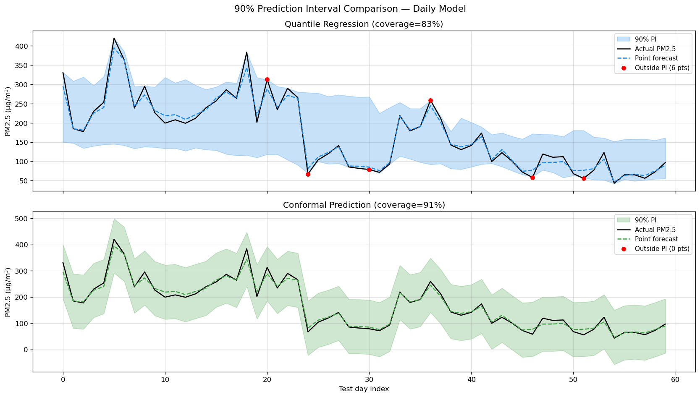

# 🌫️ Delhi Air Quality Forecasting (2021-2025)


[](https://huggingface.co/spaces/Guna-Venkat-Doddi-251140009/delhi-aq-dashboard)

**Real‑time PM2.5 predictions for 9 monitoring stations in Delhi‑NCR using Deep Learning & Machine Learning.**

## 🎯 Live Application
👉 **Interactive Dashboard:** [Hugging Face Space](https://huggingface.co/spaces/Guna-Venkat-Doddi-251140009/delhi-aq-dashboard)

The dashboard allows you to:
- View 24-hour (hourly) and 7-day (daily) PM2.5 forecasts with dynamic AQI badges.
- Perform What-If scenario analysis using interactive SHAP explainers (adjust meteorology parameters).
- Monitor detected anomalies (e.g., Diwali, stubble burning, winter fog events) utilizing Autoencoders.
- Explore spatial clustering of stations.

---

## 📌 Problem Statement
Delhi consistently faces severe air pollution, particularly during winter. Accurate predictions of the PM2.5 levels are challenging due to spatial variance, meteorological dependency, and transient events (stubble burning, Diwali). This project addresses these by employing comprehensive classical ML and state-of-the-art Transformer models on robust 5-year data spanning 9 major CPCB stations.

---

## 📂 Project Structure

```text
├── app/                  # Streamlit dashboard application files used for HF Spaces
├── code/                 # Jupyter notebooks covering the full ML lifecycle
│   ├── 01_combine_data.ipynb
│   ├── 02_preprocess.ipynb
│   ├── 03_EDA.ipynb
│   ├── 04_feature_engineering.ipynb
│   ├── 05-modeling.ipynb
│   └── 06_evaluation.ipynb
├── dataset/              # Raw data, preprocessed features, and generated metadata
├── models/               # Serialized ML/DL models (XGBoost, PatchTST, Autoencoder)
├── plots/                # Visualizations from EDA, Modeling, and XAI
├── results/              # Output predictions, metrics, and CSV reports
└── README.md             # Project documentation
```

---

## 📊 Exploratory Data Analysis & Anomalies

Extensive EDA reveals distinct diurnal, seasonal, and event-driven patterns in PM2.5 concentrations.

**Diurnal PM2.5 Cycles by Station:**


**Diwali PM2.5 Spikes Matrix:**


**K-Means Station Clusters by Pollution Profile:**


---

## 🧠 Modeling & Evaluation

We evaluated diverse model families ranging from statistical approaches (ARIMA/SARIMA) to global ML models (XGBoost) and advanced deep learning timeseries transformers (Informer, PatchTST, SimpleLSTM).

**Hourly Forecasting Winner:** `PatchTST` (Transformer)
**Daily Forecasting Winner:** `XGBoost` (Global Model)

**Model Comparison Metrics:**


**Model Performance by Station (MAE):**


### Prediction Intervals (Conformal Prediction)
We utilize Conformal Prediction and Quantile Regression to assure a 90% confidence bound on the predicted PM2.5 levels, providing essential reliability for alert formulations.



---

## 🔍 Model Explainability (SHAP)
To build trust in predictions, SHAP is integrated. Feature importance mapping reveals that apart from temporal lags, boundary layer height, temperature, and wind speed largely influence the pollutant dispersion capability.


---

## ⚡ How to Run Locally

### 1. Clone the Repository
```bash
git clone https://github.com/Guna-Venkat-Doddi-251140009/DelhiAirForecast.git
cd DelhiAirForecast
```

### 2. Environment Setup
```bash
python -m venv venv
# Windows: venv\\Scripts\\activate
# Linux/Mac: source venv/bin/activate

pip install -r app/requirements.txt
```

### 3. Launch Dashboard
```bash
streamlit run app/dashboard.py
```

---

## ✍️ Author
**Guna Venkat Doddi** – MTech student at IIT Kanpur (AI/ML). 
[GitHub](https://github.com/Guna-Venkat-Doddi-251140009) | [LinkedIn](https://linkedin.com/in/guna-venkat-doddi)

## 📄 License
MIT License
